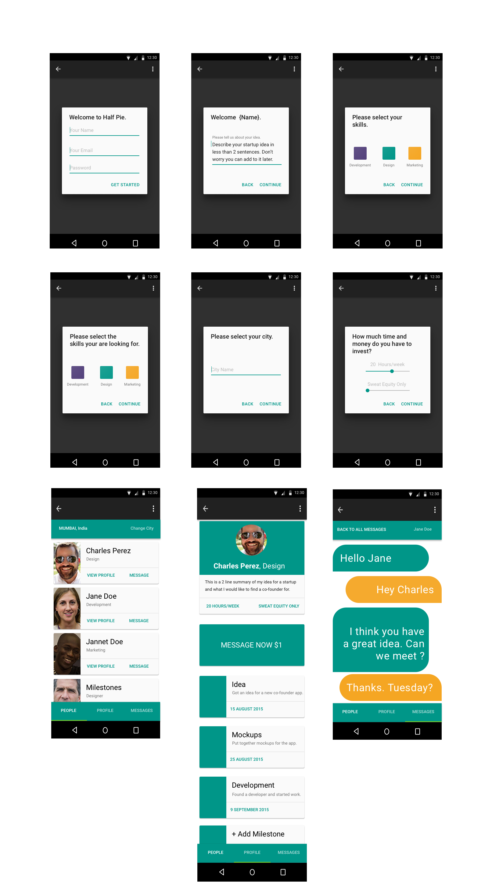

# Halfpie
An app to meet Co-Founders in your city



## Why is this useful?

The web app is useful for people who want to start a business using dynamic equity. Dynamic equity is an interesting concept proposed by Mike Moyers in a book called 'Slicing Pie'. Rather than having to find a co founder and then explain The whole idea of dynamic equity to them I wanted to create a co-founder platform only for people who already know what it is and want to use it.

In a nutshell, dynamic equity lets you start a business with someone without having to define a split before the business is created. You each work on the business and your contributions are calculated at regular intervals. The percentage of who owns what constantly changes depending on who is putting the most work in. This keeps things fair and lets you focus on the work, instead of worrying about the money.

For a more detailed explanation read this book, it's incredible: [Slicing Pie](http://amzn.to/1IiValf).

On a broader note, this project is useful because you could repurpose this web app for almost any specific interest.

## What did I use to build it?

+ [Meteor](https://www.meteor.com/install)
```
curl https://install.meteor.com/ | sh
```
+ [Differential Boilerplate](https://github.com/Differential/meteor-boilerplate) <br/>
```
git clone https://github.com/Differential/meteor-boilerplate.git <yourAppName>
```
+

## How can I help?
