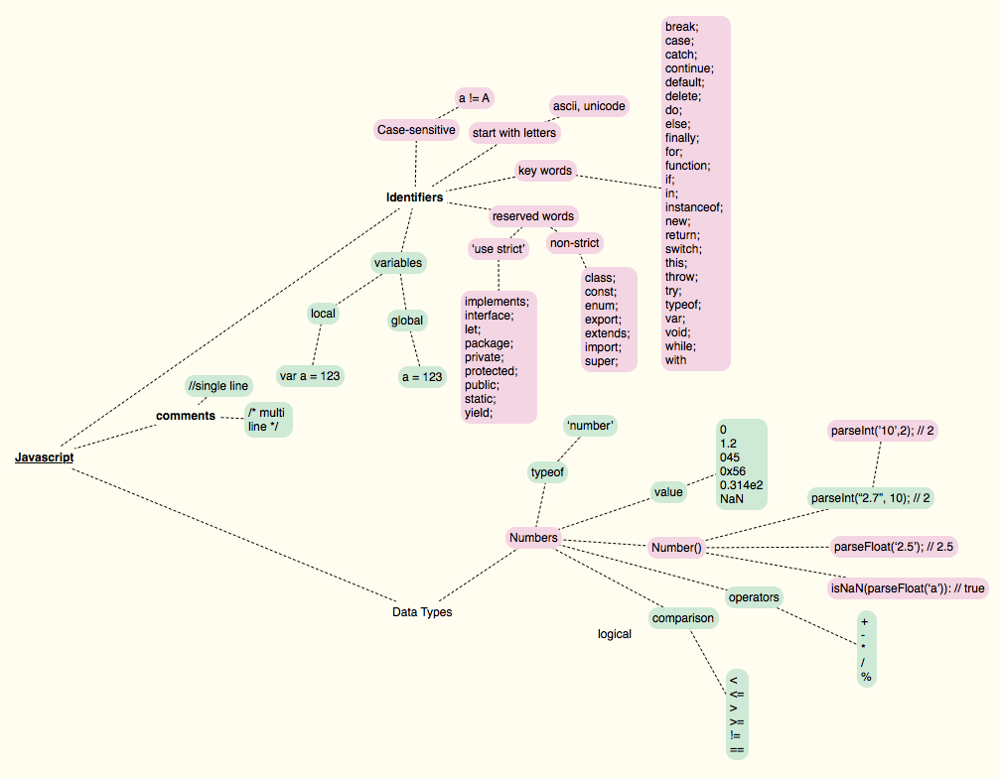

#Javascript on one page

This project is writing out javascript on one page to get a better understanding of what I do and don't understand.
The project is inspired by https://github.com/coodict/javascript-in-one-pic. I don't like the way the mindmap is arranged so I wanted to redo it. I am also splicing it with http://www.cheat-sheets.org/sites/javascript.su/ where I think things could be clearer.

Click <a href="jsonepager.pdf">here</a> for a high definition pdf.
