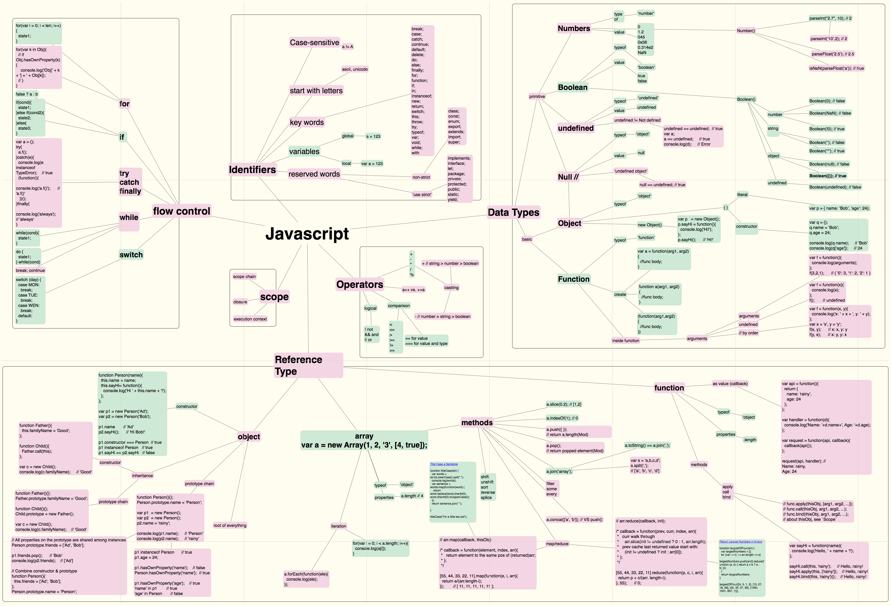

#Javascript on one page

This project is writing out javascript on one page to get a better understanding of what I do and don't understand.
The project is inspired by https://github.com/coodict/javascript-in-one-pic. I don't like the way the mindmap is arranged so I wanted to redo it. I am also splicing it with http://www.cheat-sheets.org/sites/javascript.su/ where I think things could be clearer.

Click <a href="jsonepager.pdf">here</a> for a high definition pdf.

## Things to think about

Instead of just sprawling javascript on the page make it more useful to people learning javascript. Get checkboxes for your top 10 object methods, use links instead of examples (it's too small to read anyway), list out flow control approaches. The idea being that you can go around the map checking off things as you understand how to use them.
